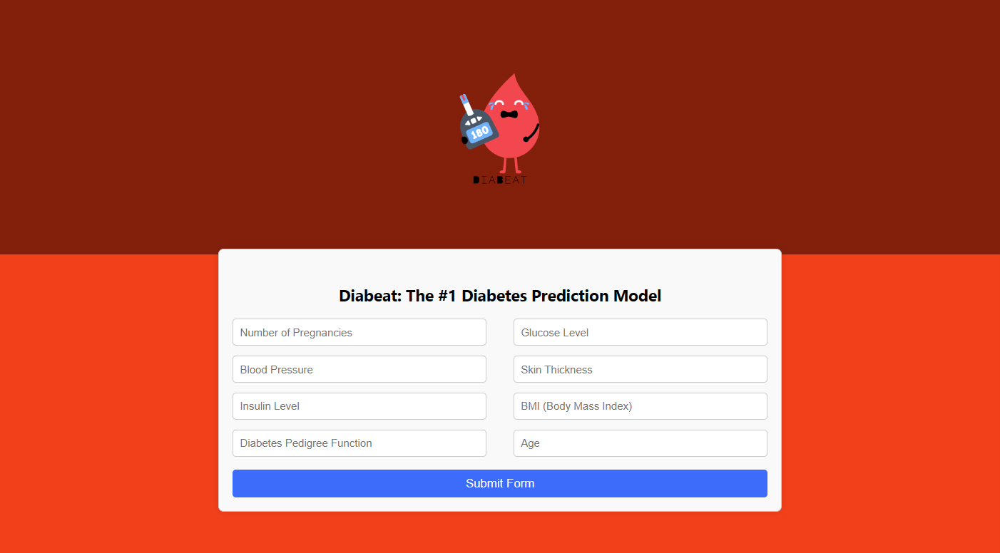
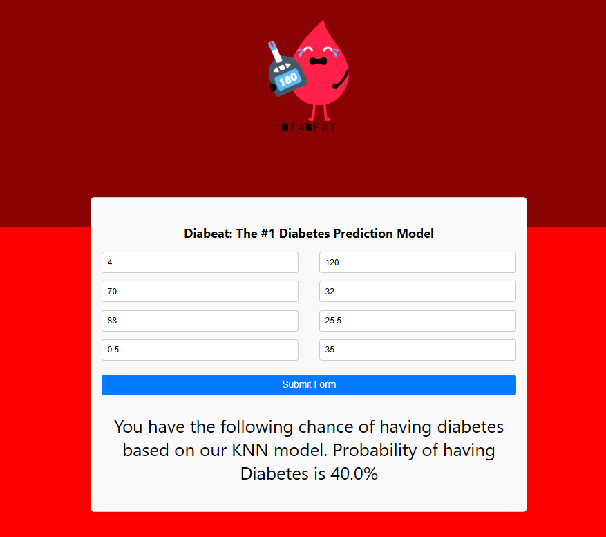
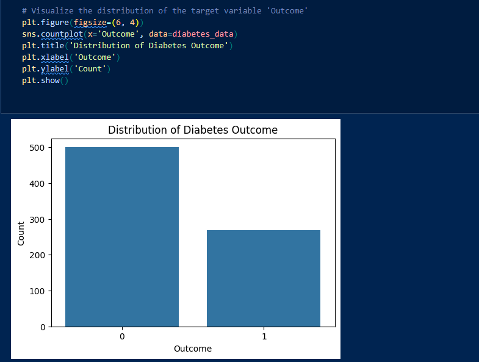

# Diabetes Prediction Application



JP Morgan Chase & Co. Hackathon 2022

This is a web application for predicting diabetes using a KNN model. The application allows users to input various health parameters and receive a prediction of whether they are likely to have diabetes or not.
# Sample Input


## Setting up the App

Navigate to Visual Studio Code (VSCode) and make sure you are running it as an administrator.

1. run git pull in the main directory of the project (in my case its Diabeat) to get the latest changes.
 ```
 git pull
```
2. or just in case run 
```
git pull origin
```

3. Navigate to the `\frontend ` directory of the project, and run this to ensure you get the latest packages/libraries.
```
npm i --force
```
 
4. Navigate to the `\backend` directory of the project and run this to ensure you get the patest packabges/libraries.
```
pip install --upgrade --force-reinstall -r installed_packages.txt

```

## Running the Application

### Backend

1. Open a terminal and navigate to the `/backend` directory of the project.

2. Start the Flask server by running:
    ```
    $ flask run
    ```
   Alternatively, you can use:
    ```
    $ python -m flask run
    ```

### Frontend

1. Open a new terminal window/tab.

2. Navigate to the `/frontend` directory of the project.

3. Start the frontend development server by running:
    ```
    $ npm start
    ```

## Debugger Setup

To enable the debugger while running the application, follow these steps:

1. In the terminal where you're running the Flask backend, set the Flask debug mode:
    ```
    $ export FLASK_DEBUG=1
    ```
    Or in powershell:
    ```
    $env:FLASK_DEBUG = 1
    ```

2. Verify that debug mode is properly set by running:
    ```
    $ echo $FLASK_DEBUG
    ```
   The output should be `1`.

3. Now, run the Flask server as usual:
    ```
    $ flask run
    ```
   or:
    ```
    $ python -m flask run
    ```

With the debugger properly set up, you can now debug your Flask application effectively.

## KNN Model Overview

The K Nearest Neighbors (KNN) algorithm is a simple and effective machine learning algorithm used for classification and regression tasks. In the context of this application, the KNN model is trained to predict whether an individual is likely to have diabetes based on their health parameters.

### How KNN Works

1. **Training the Model:**
   
   - The KNN model is trained using a dataset of known diabetes outcomes and corresponding health parameters. This dataset is typically split into a training set and a testing set.
   
   - During training, the model stores the training data in memory, essentially memorizing the feature vectors and their corresponding labels.

2. **Making Predictions:**
   
   - When presented with new, unseen data (i.e., input from the user), the KNN algorithm calculates the distance between the input data point and all other data points in the training set.
   
   - It then selects the K nearest neighbors (data points with the smallest distances) to the input data point.

3. **Classification:**
   
   - For classification tasks like predicting diabetes, the KNN algorithm assigns a label to the input data point based on the majority class among its K nearest neighbors.
   
   - For example, if the majority of the K nearest neighbors have diabetes (label 1), the algorithm predicts that the input data point also has diabetes. Otherwise, it predicts that the input data point does not have diabetes (label 0).

### KNN Model Training Example
```python
import numpy as np 
import pandas as pd  
import pickle 
from sklearn.model_selection import train_test_split
from sklearn.neighbors import KNeighborsClassifier


# Read the dataset (CSV file) into a pandas DataFrame
df = pd.read_csv('diabetes.csv')


# Separate the features (X) and target variable (y) from the DataFrame
X = df.drop('Outcome', axis=1) #- When we use `axis=1` in `df.drop('Outcome', axis=1)`, we're specifying that the operation
#   should be performed along columns (i.e., drop the 'Outcome' column).
# - In this case, `axis=1` indicates that we're dropping a column from the DataFrame.
y = df['Outcome']                # Target variable (class labels)

# Split the dataset into training and testing sets
X_train, X_test, y_train, y_test = train_test_split(X, y, test_size=0.2) # Here, `test_size=0.2` means that 20% of the data will be used for testing, and the remaining

# Initialize a KNN classifier
knn = KNeighborsClassifier()

# Train the classifier using the training data
knn.fit(X_train, y_train)

# knn_score = knn.score(X_test, y_test)

#pickle data to serialize the file then deserialize it back (save model as pickle file)

pickle.dump(knn, open('example_weights_knn.pkl', "wb"))
```


## Why we chose the dataset

Dataset Characteristics
Binary Classification: The dataset aims to predict whether a patient has diabetes (1) or not (0).
Feature Types: The dataset contains numerical features such as glucose level, BMI, age, etc.
Size: The dataset is relatively small, with 768 instances and 8 features.
Imbalance: The classes are imbalanced, with fewer positive cases of diabetes.
Matching Models to Dataset Characteristics

## K-Nearest Neighbors (KNN)
Match with dataset:

- Feature Type Compatibility: KNN works well with numerical features because it relies on distance metrics (e.g., Euclidean distance) to find the nearest neighbors. In the context of diabetes prediction, numerical data such as glucose level and BMI are crucial in determining the proximity of a new patient’s data to existing patients in the dataset. For instance, similar glucose levels often correlate with similar diabetes outcomes.

- Dataset Size: The dataset size (768 instances) is manageable for KNN, which can become computationally expensive for much larger datasets. Research indicates that for medical datasets of this size, KNN provides a balance between simplicity and computational efficiency.

- Imbalance Handling: While KNN does not inherently handle imbalanced classes, it can still perform reasonably well if the distance metric and the number of neighbors are appropriately tuned. Adjustments such as using weighted KNN, where closer neighbors have a larger influence, can help mitigate class imbalance.
## Logistic Regression
Match with dataset:

- Binary Classification: Logistic Regression is specifically designed for binary classification tasks, making it a natural fit for this dataset. It is widely used in medical research for predicting binary outcomes, such as the presence or absence of a disease. Studies show that logistic regression can effectively model the probability of diabetes based on predictor variables like glucose level and BMI.

- Interpretability: The coefficients in logistic regression can be interpreted to understand the relationship between features and the probability of having diabetes. This interpretability is crucial in medical contexts where understanding the influence of each factor (e.g., the impact of BMI on diabetes risk) is essential for clinical decisions.

- Linearity: While logistic regression assumes linearity in the relationship between features and the log-odds of the outcome, it can still perform well if the relationships are approximately linear. For example, the relationship between glucose levels and diabetes risk is often linear, making logistic regression a suitable model.
## XGBoost (Extreme Gradient Boosting)
Match with dataset:
- Handling Missing Values: XGBoost can handle missing values naturally, which is advantageous if the dataset has any missing entries. This is particularly relevant in medical datasets where patient data might be incomplete. XGBoost uses a sophisticated algorithm to handle missing data by learning which direction to go when a value is missing.

- Performance: XGBoost is known for its high performance and accuracy, which is beneficial given the imbalanced nature of the dataset. Research has demonstrated XGBoost's superiority in handling complex datasets and achieving high accuracy in medical predictions, including diabetes.

- Non-linearity: XGBoost can capture complex non-linear relationships between features and the target variable, making it suitable for datasets where such relationships exist. For example, the interaction between insulin levels, BMI, and age in predicting diabetes can be non-linear, which XGBoost can effectively model.

Random Forest
## Random Forest
Match with dataset:

- Non-linearity: Like XGBoost, Random Forest can handle non-linear relationships between features and the target variable. This is important for the diabetes dataset where non-linear interactions between features (e.g., insulin levels and BMI) may influence the outcome.

- Robustness to Overfitting: The ensemble approach of Random Forest makes it robust to overfitting, especially useful when dealing with imbalanced datasets. This robustness is critical in medical datasets where overfitting can lead to misleading conclusions. Research shows that Random Forest’s averaging process reduces variance and improves predictive accuracy in healthcare data.

- Feature Importance: Random Forest can provide insights into the importance of each feature, which can be valuable for understanding the factors contributing to diabetes. This aligns with medical research practices where identifying key risk factors (e.g., glucose levels, BMI) is crucial for disease prevention and management.

## Specific Fit for the Diabetes Dataset
- Pregnancies: The number of times a woman has been pregnant. This feature is likely to have a non-linear relationship with diabetes risk, well-handled by XGBoost and Random Forest.
- Glucose: Blood glucose level. A critical feature with a likely linear and strong relationship with diabetes, making it suitable for Logistic Regression.
- Blood Pressure: Diastolic blood pressure. Variability in this feature can be captured well by models like Random Forest and XGBoost.
- Skin Thickness: Skin fold thickness. Another numerical feature that might have a complex relationship with diabetes risk, suited for non-linear models.
- Insulin: Serum insulin. Can have missing values and non-linear relationships, fitting well with XGBoost and Random Forest.
- BMI: Body mass index. Important and often linear, making it suitable for Logistic Regression while also being handled well by other models.
- Diabetes Pedigree Function: A function that scores likelihood of diabetes based on family history. Non-linear relationships can be captured by Random Forest and XGBoost.
- Age: Age of the patient. Typically has a straightforward relationship with diabetes risk, handled well by Logistic Regression.
## Summary
KNN: Good for small datasets and simple decision boundaries. Useful as a baseline model.
Logistic Regression: Suitable for binary classification and linear relationships, providing interpretability.
XGBoost: Excellent for performance, handling non-linearity and missing values, and robust to class imbalance.
Random Forest: Robust to overfitting, can handle non-linearity, and provides feature importance insights.